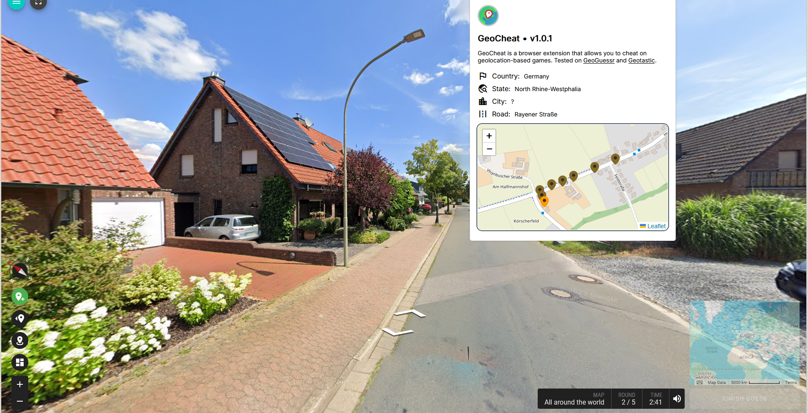

<div align="center">


# GeoCheat

GeoCheat is a browser extension that allows you to cheat on geolocation-based games. Tested on both GeoGuessr and Geotastic.

</div>


## 📖 • Table of Contents

- [🚀 • Introduction](#--introduction)
- [📦 • Installation](#--installation)
- [🔨 • Development](#--development)
- [📜 • Credits](#--credits)
- [📝 • License](#--license)


## 🚀 • Introduction

GeoCheat is a browser extension that allows you to cheat on geolocation-based games. Tested on both GeoGuessr and Geotastic.
  
This project lets you set your geolocation to any location in the world.  
  
  
  
The orange marker on the map represents your first location, the brown markers represent the locations you've already visited.  

The extension is available for both Chrome and Firefox.  

## 📦 • Installation

This projects isn't meant to be published on the Chrome Web Store nor Firefox Add-ons. Cheating is bad, this project is more of a proof of concept. If you want to use it, you'll have to install it manually.  
  
You will have to download the latest release from the [releases page](https://github.com/PaulBayfield/GeoCheat/releases) and install it manually in your browser.

## 🔨 • Development

If you want to contribute to the development of the extension, here's how to proceed.

### Installation

You need to have the latest LTS versions of node/npm (node v20, npm v10)

```bash
npm install
```

### Compilation

To compile the project in development mode.

```bash
npm run dev
```

To compile the project in production mode.

```bash
npm run prod
```

To compile the project in production mode and generate a zip archive.

```bash
npm run zip
```

## 📜 • Credits

Made by [Paul Bayfield](https://github.com/PaulBayfield).

## 📝 • License

This project is under the [MIT](/LICENSE) license.
